# PathCare

On-demand pathology and diagnostics for Dehradun. A patient books a lab test from the web or the app, a certified phlebotomist collects the sample at home, and the sample is tracked — barcoded and temperature-logged — to an accredited partner lab. The patient watches every step live.

Three clients over one API: a React website, a React Native patient app, and a separate React Native app for phlebotomists.

---

## Contents

- [Screenshots](#screenshots)
- [Tech stack](#tech-stack)
- [Repository layout](#repository-layout)
- [Architecture](#architecture)
- [The booking lifecycle](#the-booking-lifecycle)
- [How a cart is priced](#how-a-cart-is-priced)
- [Real-time tracking](#real-time-tracking)
- [Running it locally](#running-it-locally)
- [Tests](#tests)
- [Design rules worth knowing](#design-rules-worth-knowing)
- [Further documentation](#further-documentation)

---

## Screenshots

Captured from the running app against a live API and a seeded catalogue — the
prices, lab comparisons and totals below are real responses, not mockups.

### The website

| Landing page | Test catalogue |
|---|---|
| 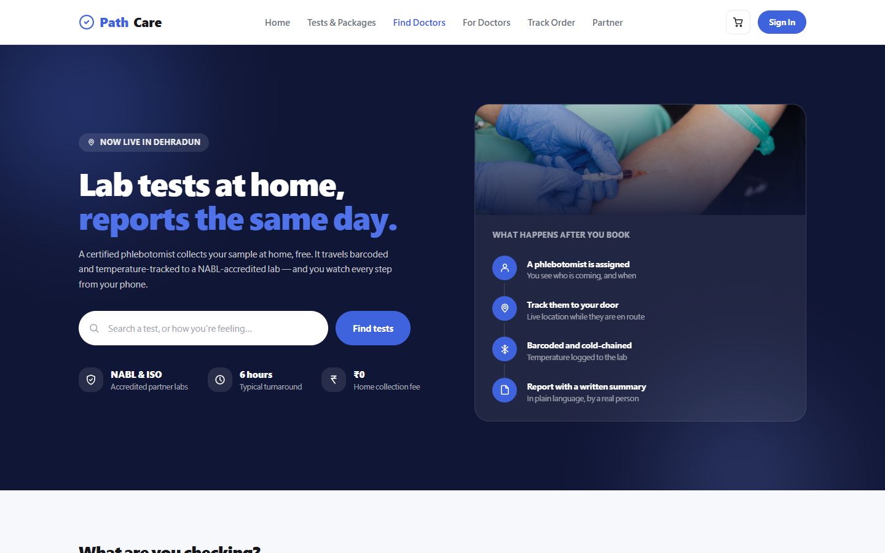 | 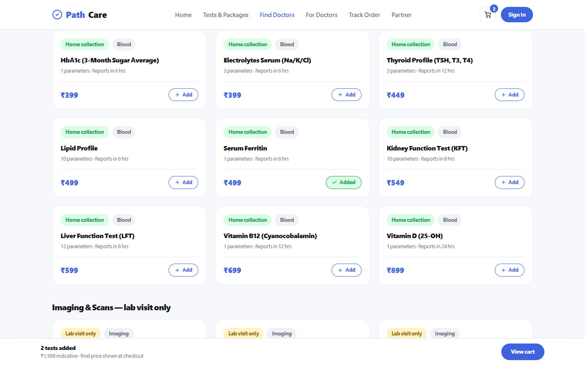 |

**One basket, one visit, one payment.** A checkup and an extra test it does not
cover, priced together — instead of making the patient book twice.

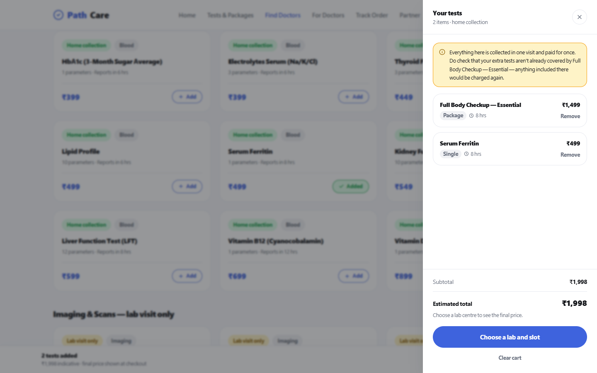

| Test detail, with live per-lab prices | Create an account |
|---|---|
| 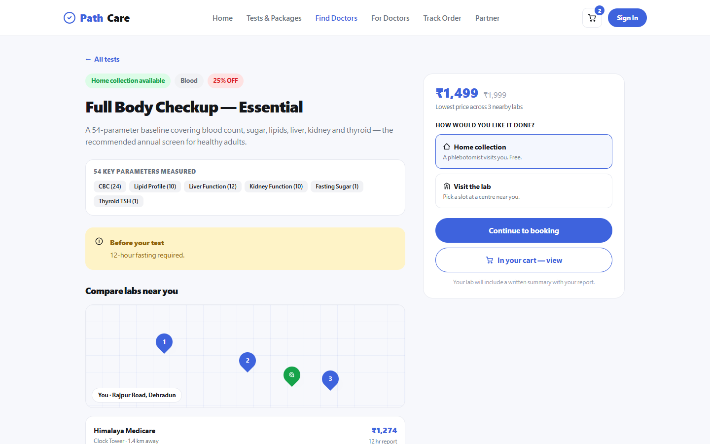 | 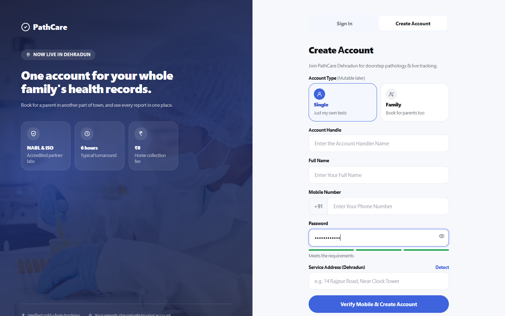 |

| Sign in | Find a doctor |
|---|---|
| 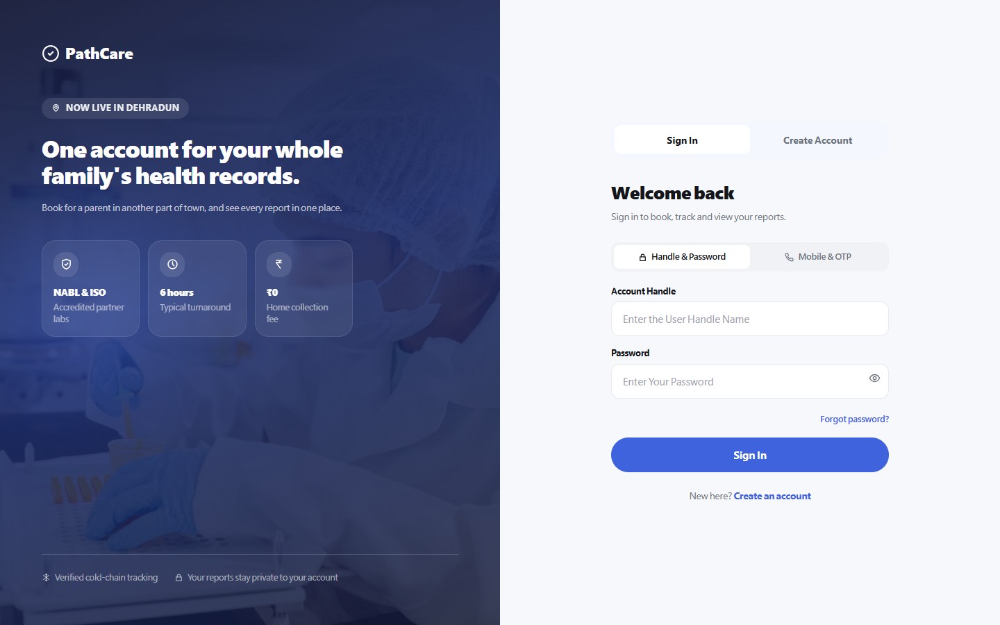 | 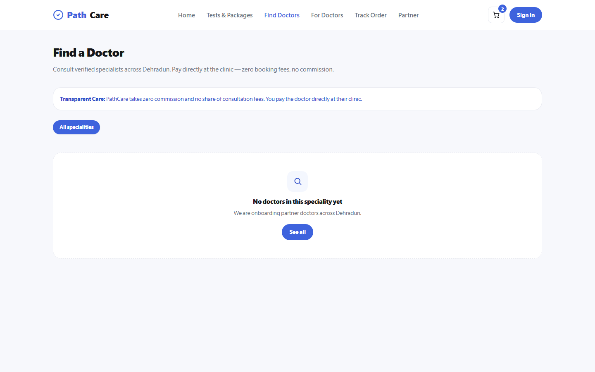 |

### Still to add

These need something this capture could not provide. Drop the files into
`docs/screenshots/` with these exact names and the tables above can be extended
to include them — `docs/screenshots/README.md` says what each should show.

**Signed-in web pages** — `web-profile.png`, `web-booking.png`,
`web-tracking.png`. These sit behind `ProtectedRoute`, and signing in needs a
patient session. Re-run the capture script with credentials once Redis is up
and OTP sign-in works.

**Both mobile apps** — `app-home.png`, `app-test-detail.png`, `app-booking.png`,
`app-tracking.png`, `rider-jobs.png`, `rider-collection.png`,
`rider-handoff.png`. Capturing these needs either an Android emulator or a
screenshot taken on a physical device running Expo Go.

## Tech stack

**Backend** — Node.js 24, Express 4, MongoDB 8 via Mongoose, Redis via ioredis, BullMQ for background jobs, Socket.IO 4 with the Redis adapter, JWT auth with bcrypt, Helmet, AWS S3 for report storage.

**Website** — React 18, Vite 6, React Router 7, TanStack Query 5, Tailwind CSS, Axios, Socket.IO client, TipTap for the lab's report editor.

**Mobile** — Expo SDK 57, React Native 0.86, React 19, React Navigation 7, TanStack Query with an AsyncStorage persister, `react-native-maps`, `expo-secure-store` for tokens, `expo-sqlite` for the offline cache, `expo-notifications` for push.

**Shared workspace packages** — `@pathcare/api` (HTTP client and query hooks), `@pathcare/validators` (Zod schemas used by both the server and the clients), `@pathcare/design-tokens` (the entire colour, type and spacing palette).

**Tooling** — pnpm workspaces, ESLint, Jest for the backend, Vitest for the web, `node:test` for shared packages and mobile, Detox configured for mobile E2E, Terraform in `infra/`.

---

## Repository layout

```
backend/          Express API + BullMQ worker (two entrypoints, one codebase)
  src/
    routes/       HTTP surface, versioned under /api
    controllers/  request → service, no business logic
    services/     all business logic and every money calculation
    repositories/ the only place that talks to Mongoose
    schemas/      Mongoose models
    queues/       BullMQ producers
    processors/   BullMQ consumers, run by src/worker.js
    scripts/      seeding, index sync, migrations, rider provisioning
frontend/         React website (Vite)
mobile/User/      Patient app (Expo)
mobile/Rider/     Phlebotomist app (Expo)
common/
  api/            Shared HTTP client + TanStack Query hooks
  validators/     Zod schemas shared by server and clients
  design-tokens/  Colours, typography, spacing, avatar identity
infra/            Terraform
```

The API and the worker are **the same codebase with two entrypoints** — `src/index.js` serves HTTP, `src/worker.js` runs the queues. They share services and repositories, so a rule enforced in a service applies whether it was reached by a request or a job.

---

## Architecture

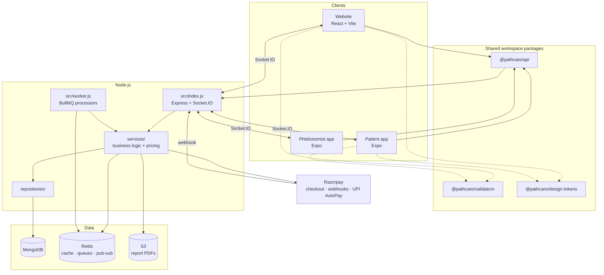

**Two Redis clients, deliberately.** The request path uses a fail-fast client (`enableOfflineQueue: false`, one retry, 2s connect timeout) so that Redis being down degrades the API instead of hanging it. BullMQ needs the opposite (`maxRetriesPerRequest: null`, offline queue on) or it refuses to start. Mixing them up once took the whole API down: every request awaited a Redis command that would never resolve. See `backend/src/config/redisConfig.js`.

---

## The booking lifecycle

A booking has one collection mode for its entire life, and the state machine differs per mode. Transitions are enforced server-side in `statusTransitionService.js` — a client cannot move a booking to a state the machine does not allow, and each role can only reach the states listed for it.

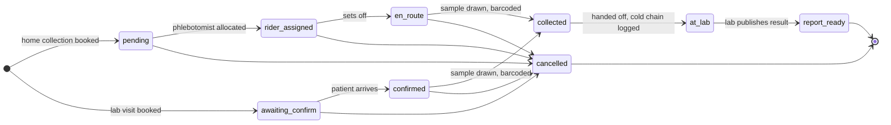

A booking can be cancelled any time **before** the sample is collected, never after — once someone's blood is drawn there is nothing to cancel. Refunds are computed server-side from the cancellation point.

**Roles:** `patient`, `rider`, `lab_admin`, `doctor`, `super_admin`. A patient can only reach `cancelled`; a rider drives `rider_assigned → en_route → collected → at_lab`; a lab admin handles `confirmed`, `report_ready` and cancellation.

---

## How a cart is priced

The same test genuinely costs different amounts at different centres, so a price only exists once a lab is chosen. **Every figure a patient sees comes from the server.** The clients render the response; they do not compute money.

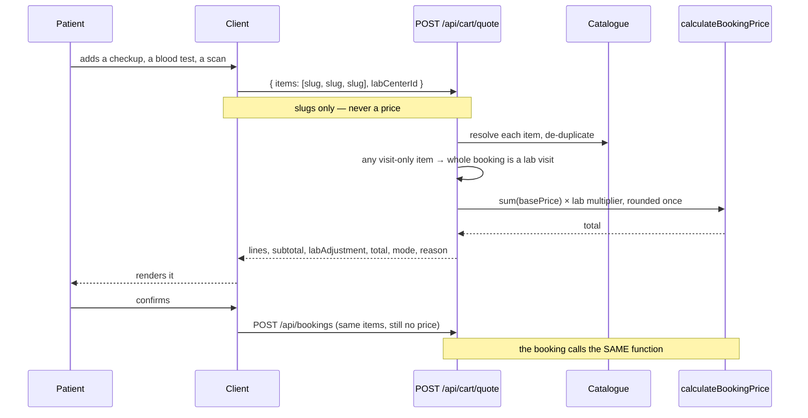

Three things this design protects:

1. **A quote cannot disagree with the debit.** The endpoint and the booking both call `calculateBookingPrice` — the same function, not a copy of its formula.
2. **Rounding happens once, over the whole basket.** Multiplying and rounding each line separately drifts: at a 1.15 multiplier, ₹99 + ₹104 is ₹233 rounded once and ₹234 rounded per line. A quote a rupee off the debit is, to a patient, indistinguishable from being overcharged. So line items show catalogue prices and the lab's effect is a single adjustment row — the column adds up to what you pay.
3. **The client never proposes an amount.** A client-supplied `amount` is accepted by the schema and then ignored; the server prices from the live catalogue.

**One booking, one visit.** A basket can hold checkup packages, individual tests and imaging together. If anything in it needs lab equipment the whole booking becomes a lab visit, and the response says which item caused that. One slot, one phlebotomist, one payment — instead of making the patient book twice.

---

## Real-time tracking

Booking status changes are pushed over Socket.IO, fanned out across API instances by the Redis adapter. The patient's tracking screen and the rider's job screen both subscribe to the same booking room.

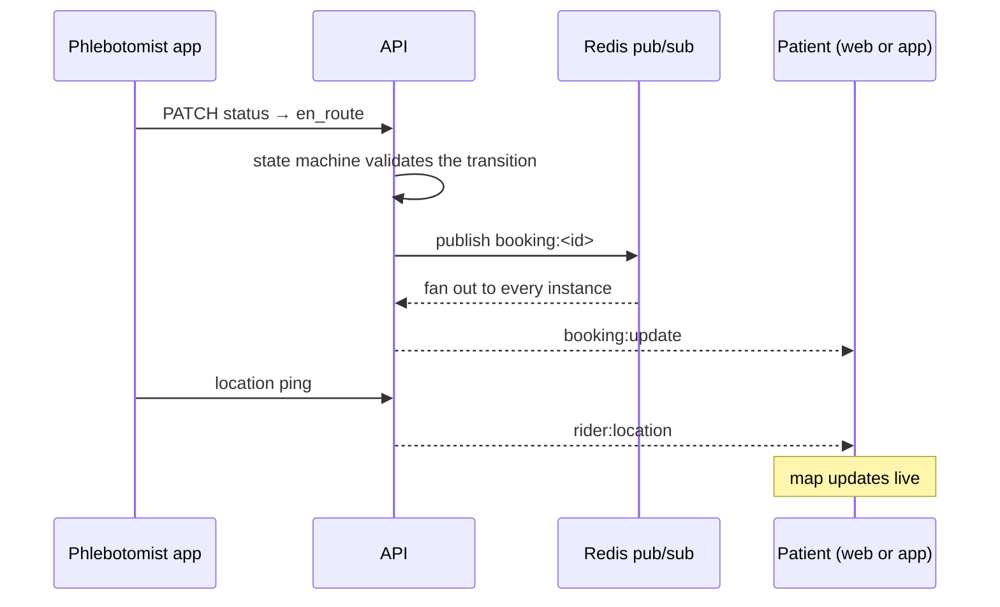

If the socket drops, the client refetches over HTTP and reconciles — the REST response is the source of truth, the socket is only an accelerator.

---

## Running it locally

**Prerequisites:** Node.js 24, pnpm 11, MongoDB on `:27017`, Redis on `:6379`.

```bash
pnpm install
```

Copy `backend/.env.example` to `backend/.env` and fill it in, then seed the catalogue:

```bash
pnpm --filter @pathcare/backend seed:catalogue
```

Start the API, the worker and the website together:

```bash
pnpm dev
```

- API → `http://localhost:5000`
- Website → `http://localhost:5173`

Either mobile app:

```bash
cd mobile/User && npx expo start
```

Point `EXPO_PUBLIC_API_URL` in `mobile/User/.env` at a host your phone can reach — your machine's LAN address when the phone is on the same network, or a tunnel otherwise. `localhost` will not resolve from a device.

`RUNBOOK.md` covers the day-to-day commands; `DEPLOYMENT.md` covers EC2, the load balancer and production environment variables.

---

## Tests

```bash
pnpm verify     # lint + unit + integration, everything
pnpm test       # unit
pnpm test:integration
```

| Suite | Runner | Count |
|---|---|---|
| Backend | Jest, in-band, `MongoMemoryServer` | 392 across 39 suites |
| Website | Vitest + Testing Library | 153 across 21 files |
| Patient app | `node:test` | 24 |
| Phlebotomist app | `node:test` | 10 |
| Shared packages | `node:test` | 33 (api 10, validators 6, design-tokens 17) |

Integration tests run against a real in-memory MongoDB, not mocks — transactions need a replica set, which `MongoMemoryReplSet` provides.

A note on the money tests: several of them use prices chosen so the correct answer is **impossible to reach by any other route**. A stub returning `round(subtotal × multiplier)` is satisfied whether the client reads the server's total or recomputes it, so it proves nothing. The values in `cartQuote.test.js` and `checkout.test.js` were picked to distinguish the two, and the implementations were mutated to confirm the tests actually fail.

---

## Design rules worth knowing

These are enforced in code and in tests, not just documented.

- **No fabricated data, anywhere.** No invented customer counts, star ratings or on-time percentages — the landing page has tests asserting their absence. Empty states say "nothing yet", they do not show samples.
- **Never charge from a cached or bundled price.** The mobile app ships a bundled catalogue so the first screen is not blank; checking out from one throws rather than charging. Not a convention — a thrown error.
- **The server owns every calculation involving money.**
- **Reports are written by people.** A qualified person at the processing lab writes each summary. No algorithm interprets a result.
- **PathCare takes no share of consultation fees.** Patients pay partner doctors directly, and no referral commissions are paid. This is stated in the UI wherever a doctor appears.
- **Accreditation is verified, not assumed.** Partner labs record NABL/ISO status with expiry tracking.

---
